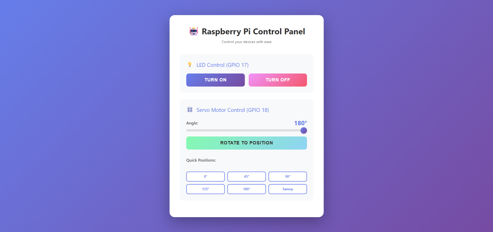

# 🤖 Raspberry Pi Control Panel

A beautiful web-based control interface for Raspberry Pi GPIO devices built with ASP.NET Core. Control LEDs and servo motors from any device on your network with an intuitive, modern UI.



## ✨ Features

### 💡 LED Control
- Turn LED on/off with simple button clicks
- Real-time status feedback
- Controls GPIO pin 17

### 🎛️ Servo Motor Control
- Interactive slider for precise angle control (0° - 180°)
- Quick position presets (0°, 45°, 90°, 135°, 180°)
- Auto-sweep function for testing
- Software PWM implementation (no special configuration required)
- Controls GPIO pin 18

### 🌐 Network Access
- Access from any device on your local network
- Responsive design works on desktop, tablet, and mobile
- Beautiful gradient UI with smooth animations

## 🚀 Getting Started

### Prerequisites

- Raspberry Pi (any model with GPIO)
- .NET 8.0 SDK installed
- LED connected to GPIO 17
- Servo motor connected to GPIO 18

### Installation

1. Clone the repository:
```bash
git clone <your-repo-url>
cd ConsoleApp1
```

2. Build the project:
```bash
dotnet build
```

3. Run the application:
```bash
dotnet run
```

4. Access the control panel:
   - From the Raspberry Pi: `http://localhost:5000`
   - From another device: `http://<raspberry-pi-ip>:5000`

To find your Raspberry Pi's IP address:
```bash
hostname -I
```

## 🔌 Hardware Setup

### LED Connection
- **Anode (+)**: GPIO 17 → 220Ω resistor → LED
- **Cathode (-)**: GND

### Servo Motor Connection
- **Signal**: GPIO 18
- **Power (VCC)**: 5V (external power recommended for larger servos)
- **Ground (GND)**: GND

## 📋 API Endpoints

The application also provides REST API endpoints:

### LED Control
- `GET /gpio/on` - Turn LED on
- `GET /gpio/off` - Turn LED off

### Servo Control
- `GET /rotate/{angle}` - Rotate servo to specified angle (0-180)

### Legacy Endpoints
- `GET /numbers?one=1&two=2&three=3` - Number testing endpoint
- `POST /numbers` - Accept JSON payload with numbers

## 🛠️ Technology Stack

- **Backend**: ASP.NET Core 8.0
- **GPIO Control**: System.Device.Gpio
- **PWM**: Software PWM implementation
- **Frontend**: Pure HTML/CSS/JavaScript
- **Styling**: Modern CSS with gradients and animations

## 📱 Web Interface Features

- **Responsive Design**: Works seamlessly on all screen sizes
- **Real-time Feedback**: Instant status updates for all actions
- **Smooth Animations**: Professional hover effects and transitions
- **Intuitive Controls**: Easy-to-use sliders and buttons
- **Auto-hide Notifications**: Status messages fade after 3 seconds

## 🎨 UI Highlights

- Purple gradient background
- Card-based layout with shadow effects
- Color-coded buttons for different actions
- Interactive range slider with custom styling
- Quick access buttons for common servo positions
- Sweep function for servo testing

## 🔧 Configuration

The application is configured to:
- Listen on all network interfaces (`0.0.0.0:5000`)
- Use GPIO 17 for LED control
- Use GPIO 18 for servo motor control
- Generate 50Hz PWM signal for servo control
- Support servo angles from 0° to 180°

### Changing GPIO Pins

Edit the pin constants in `Program.cs`:
```csharp
const int pin = 17;        // LED pin
const int servoPin = 18;   // Servo pin
```

### Changing the Port

Modify the URL configuration in `Program.cs`:
```csharp
builder.WebHost.UseUrls("http://0.0.0.0:5000");
```

## 🐛 Troubleshooting

### "Permission denied" errors
Run with sudo or add your user to the `gpio` group:
```bash
sudo usermod -a -G gpio $USER
```

### Servo not responding
- Check power connections (servos need adequate power)
- Verify GPIO 18 is not being used by another process
- Ensure servo signal wire is properly connected

### Cannot access from other devices
- Verify firewall allows port 5000:
```bash
sudo ufw allow 5000
```
- Confirm devices are on the same network
- Check Raspberry Pi's IP address

## 📝 License

This project is open source and available under the MIT License.

## 🤝 Contributing

Contributions, issues, and feature requests are welcome!

## 👨‍💻 Author

Built with ❤️ for Raspberry Pi enthusiasts

---

**Note**: This project uses software PWM for servo control, which doesn't require enabling hardware PWM in the Raspberry Pi configuration. While not as precise as hardware PWM, it works reliably for most hobby servo applications.
